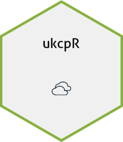

<!-- README.md is generated from README.Rmd. Please edit that file -->

```{r, include = FALSE}
knitr::opts_chunk$set(
  collapse = TRUE,
  comment = "#>",
  fig.path = "man/figures/README-",
  out.width = "100%"
)
```

# ukcpR

<!-- badges: start -->

<br>
[](https://lifecycle.r-lib.org/articles/stages.html#experimental)
<!-- badges: end -->

The goal of ukcpR is to make it a bit easier to interact with the UK [Met Office](https://www.metoffice.gov.uk/)'s [UK Climate Projections](https://www.metoffice.gov.uk/research/approach/collaboration/ukcp) (UKCP) data, via its API, then work with the data produced

At the moment the package is __focused on a limited number of document types, all of which are .csv files__. This may expand to further document types in the future, but for now this helps in some instances. Currently you can use this package to run queries on:

* Observations from HadUK-Grid over UK for daily data
* Observations from HadUK-Grid over UK for monthly, seasonal or annual data
* Variables from local/regional/global projections over UK for monthly, seasonal or annual data

Note: __this package relies on you already having a UKCP account__. You will not be able to use the API without a key it provides. By default this package assumes the key will be stored as an environment variable `UKCP_API_KEY` in your `.Renviron` file, but you can overwrite if desired. It should be noted that any queries you make via the API will be logged (and results accessible) in the UKCP web interface.

You also need to have some understanding of possible values for API parameters. The nature of this package is you can freely enter any old text, and even if individual parameters are valid, they may not work in combination. Reading up/doing some trials via the UI initially will probably save a lot of frustration.

See the [how-to guide](https://shanej90.github.io/ukcpR/articles/using-ukcpr) for more information and examples. 

## Installation

You can install the development version of ukcpR as follows:

```{r install, eval = F, echo = T}
remotes::install_github("shanej90/ukcpR")
```
